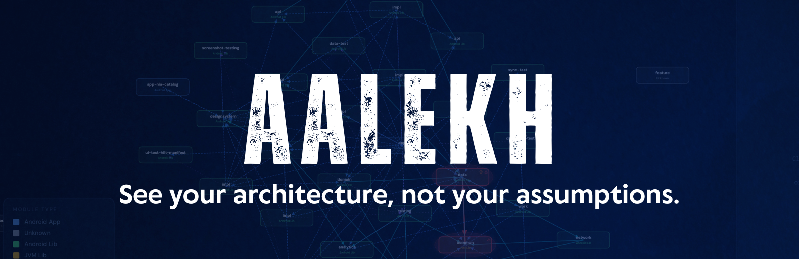
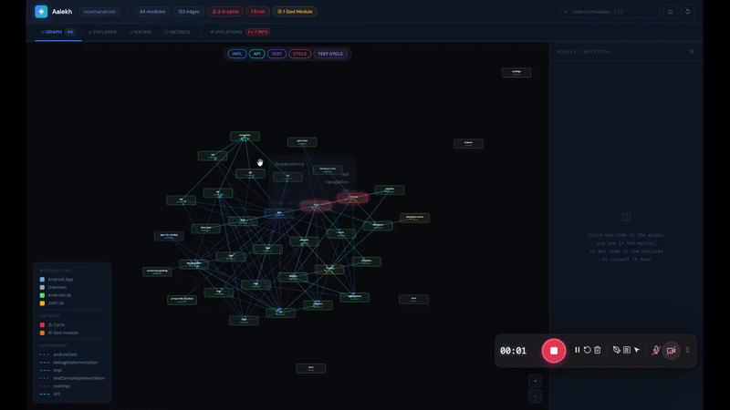

# Aalekh

<p align="center">
  
</p>

<p align="center">
  <a href="https://kotlinlang.org"></a>
  <a href="https://gradle.org"></a>
  <a href="https://central.sonatype.com/artifact/io.github.shivathapaa/aalekh-model"></a>
</p>

<p align="center">
  <a href="https://plugins.gradle.org/plugin/io.github.shivathapaa.aalekh"></a>
  <a href="https://docs.gradle.org/current/userguide/configuration_cache.html"></a>
  <a href="LICENSE"></a>
</p>

**Architecture Visualization & Linting for Gradle Multi-Module Projects**

Aalekh is a Gradle plugin that extracts, visualizes, and enforces architectural rules across any
Gradle multi-module project - Kotlin Multiplatform, Android, JVM, or any Gradle project. It gives
teams three capabilities that no existing tool provides together: an **interactive module graph**, a
**Kotlin DSL for architecture rule enforcement**, and **historical metrics tracking**.

### Sample Reports

- Now in Android App
    - [View locally](assets/report_samples/nowinandroid.html)
    - [View on GitHub Pages](https://shivathapaa.github.io/Aalekh/assets/report_samples/nowinandroid.html)

- Now in Android App - with cyclic dependency
    - [View locally](assets/report_samples/nowinandroid_withcyclic.html)
    - [View on GitHub Pages](https://shivathapaa.github.io/Aalekh/assets/report_samples/nowinandroid_withcyclic.html)

- Tallyo (KMP)
    - [View locally](assets/report_samples/tallyo.html)
    - [View on GitHub Pages](https://shivathapaa.github.io/Aalekh/assets/report_samples/tallyo.html)

### Sample Report Demo

<p align="center">
  <a href="assets/report_samples/nowinandroid.html">
    
  </a>
</p>

## Why Aalekh?

| Tool       | Visualizes | Enforces rules | Tracks metrics | KMP-aware |
|------------|:----------:|:--------------:|:--------------:|:---------:|
| **Aalekh** |   **✓**    |     **✓**      |     **✓**      |   **✓**   |

Aalekh **visualizes, enforces, and tracks** - in a single plugin, with zero external dependencies
beyond the browser.

## Quick Start

**1. Add to `settings.gradle.kts`:**

```kotlin
plugins {
    id("io.github.shivathapaa.aalekh") version "0.4.0"
}
```

**2. Run:**

```bash
./gradlew aalekhReport
```

An interactive HTML report opens automatically in your default browser. No configuration required.

## Installation

### Settings plugin (recommended)

Apply in `settings.gradle.kts`. The settings plugin loads in a classloader scope that is stable
across configuration cache entries, preventing cache misses on second runs.

```kotlin
// settings.gradle.kts
plugins {
    id("io.github.shivathapaa.aalekh") version "0.4.0"
}
```

### Project plugin (deprecated)

> **⚠ Deprecated as of v0.2.0.** The project plugin will be removed in a future release. Please
> migrate to the settings plugin above.

If you are still on the project plugin, you will see a migration warning at build time. To migrate:
remove the plugin from `build.gradle.kts` and add it to `settings.gradle.kts` instead. The
`aalekh { }` configuration block in `build.gradle.kts` stays exactly as-is.

```kotlin
// build.gradle.kts (root project only) - deprecated, migrate to settings plugin
plugins {
    id("io.github.shivathapaa.aalekh.project") version "0.4.0"
}
```

## Gradle Tasks

Aalekh registers three tasks on the root project, all in the `aalekh` task group.

| Task                      | Description                                                                                 |
|---------------------------|---------------------------------------------------------------------------------------------|
| `./gradlew aalekhExtract` | Extracts the module dependency graph and writes it as JSON to `build/tmp/aalekh/graph.json` |
| `./gradlew aalekhReport`  | Generates the interactive HTML report at `build/reports/aalekh/index.html`                  |
| `./gradlew aalekhCheck`   | Evaluates all architecture rules; fails the build on `ERROR`-severity violations            |

`aalekhCheck` is automatically wired into the standard `check` lifecycle task, so it runs as part
of `./gradlew check` without any extra configuration.

To wire it into CI explicitly:

```kotlin
// build.gradle.kts (root project)
tasks.named("check") {
    dependsOn("aalekhCheck")
}
```

### `aalekhReport` - interactive HTML report

```bash
./gradlew aalekhReport
```

Generates `build/reports/aalekh/index.html` - a fully self-contained HTML file with no server, no
CDN, and no internet connection required. The report opens automatically in your default browser
after the task completes (disable with `openBrowserAfterReport.set(false)` for CI).

The intermediate graph JSON is written to `build/tmp/aalekh/graph.json` and is cleaned by
`./gradlew clean`.

### `aalekhCheck` - architecture rule enforcement

```bash
./gradlew aalekhCheck
```

Evaluates all registered architecture rules against the extracted dependency graph. On completion it
writes:

- `build/reports/aalekh/aalekh-results.xml` - JUnit XML (consumed natively by all CI systems)
- `build/reports/aalekh/aalekh-results.json` - full machine-readable report: graph, summary, violations, version, and timestamp
- `build/reports/aalekh/aalekh-results.sarif` - SARIF 2.1 for GitHub code scanning PR annotations

If any `ERROR`-severity violation is found, the task fails with a summary message:

```
Aalekh: 2 architecture violation(s) found.
See build/reports/aalekh/aalekh-results.xml for details.
```

`WARNING`-severity violations are printed to stdout but do not fail the build. `INFO`-severity
violations are silently collected and visible in the HTML report only.

### `aalekhExtract` - raw graph JSON

```bash
./gradlew aalekhExtract
```

Extracts and serializes the full module dependency graph to `build/tmp/aalekh/graph.json`. Both
`aalekhReport` and `aalekhCheck` depend on this task implicitly - you rarely need to run it
directly.

## The Report

`./gradlew aalekhReport` produces `build/reports/aalekh/index.html`. Open it in any browser - no
server required.

### Five panels

**⬡ Graph** - Interactive force-directed visualization powered by D3.js. Drag to orbit, scroll to
zoom, click any node to inspect it in the sidebar. Nodes are coloured by module type; cycle nodes
pulse with a red ring; god modules glow orange. Filter edges by type: Impl, API, Test, CompileOnly,
KMP source sets, Main Cycle, Test Cycle.

**⊞ Explorer** - Hierarchical tree view mirroring your Gradle project structure. Expand and collapse
groups, jump directly to cycle nodes, and see per-module dependency tables split by main vs test
scope.

**⊟ Matrix** - Adjacency matrix showing all inter-module dependencies at a glance. Hover a cell for
details; click a row or column label to inspect the module and sync with the graph.

**◎ Metrics** - KPI dashboard with fan-in, fan-out, instability index, critical build path, god
module count, and cycle counts. Main cycles and test-only cycles are reported separately. Per-module
sortable table with inline bar charts. Includes a **layer purity table** showing the percentage of
edges flowing in the correct declared direction, and **consolidation candidates** - module pairs
that share a high number of dependents and may be worth merging.

**⚑ Violations** - Structured violation cards for every `aalekhCheck` failure. Each card shows the
rule ID, severity badge, the exact dependency edge to remove, a plain-language explanation of why
the rule exists, and a "View in Graph" button that navigates directly to the offending module.
Violation messages include the build file path and line number where the offending dependency
is declared.

When no violations exist and no layer rules are configured, the panel analyses your module paths
and suggests a ready-to-paste `layers { }` DSL block based on detected `domain`, `data`, and
`ui`/`presentation` patterns.

### Interactive features

The report includes a full set of analytical tools accessible directly from the browser:

| Feature | Description |
|---------|-------------|
| **URL permalink** | Active tab and selected module are encoded in `location.hash` - paste the URL to share a specific view |
| **Architecture debt score** | 0–100 badge in the report header summarising technical debt across all rules |
| **Blast radius** | Module Inspector shows transitive dependent count - modules that would break if this module changes |
| **Path finder** | Enter any two modules to find the shortest dependency path; the result is highlighted in the graph |
| **Instability heatmap** | Toggle to colour nodes from green (stable) to red (unstable) based on instability index |
| **Layer purity table** | Metrics panel table showing the percentage of edges flowing in the correct layer direction |
| **Consolidation candidates** | Module pairs that share many dependents and may be worth merging |
| **SVG export** | Download the current Graph, Explorer, or Matrix view as an SVG file |
| **Snapshot diff** | Drag-drop a previous `graph.json` to see modules and edges added or removed since that snapshot |
| **Animated edge flow** | Hovering a node animates traffic along its edges to make dependency direction obvious |
| **Team ownership overlay** | Colour stripes from the `teams { }` DSL config identify which team owns each module |
| **Trend sparklines** | KPI cards include a sparkline chart of that metric over the last 30 `aalekhReport` runs |
| **ADR links in tooltips** | Edge tooltips show a clickable link to the Architecture Decision Record that justifies the dependency |

### Metrics CSV export

Set `exportMetrics.set(true)` to write `aalekh-metrics.csv` alongside the HTML report on every
`aalekhReport` run. The CSV contains one timestamped row per module with fan-in, fan-out,
instability, transitive dep count, health score, and boolean flags for god module, critical path,
and cycle participation. Import into Datadog, Grafana, or a spreadsheet for external trending.

### Trend history

Every `aalekhReport` run appends a snapshot to `build/aalekh/trend.json` (up to 30 entries). The
file is read on the next run and the data is embedded in the report to power the trend sparklines
in the KPI cards. Failure to read or write the file is always non-fatal and never breaks the build.

### Sidebar - Module Inspector

Click any node in the graph to open the module inspector in the right sidebar. It shows:

- Module path and short name
- Module type badge (colour-coded)
- Fan-in, fan-out, and transitive dependency count
- **Blast radius** - number of modules that transitively depend on this one
- Instability index bar (green = stable, yellow = mixed, red = unstable)
- KMP source sets (if applicable)
- Direct dependencies and dependents (clickable, navigate to the target node)

### Cycle detection

Aalekh distinguishes between two kinds of cycles:

- **Main cycles** (`⚠ red`) - circular dependencies in production code. These are genuine
  architectural errors that prevent independent builds and refactoring. `aalekhCheck` fails on these
  by default.
- **Test cycles** (`♻ pink`) - cycles that exist only through `testImplementation` or
  `androidTestImplementation`. These are common, usually acceptable, and do **not** cause a build
  failure.

## Configuration

All configuration lives in the `aalekh { }` block in the root `build.gradle.kts`.

```kotlin
aalekh {
    // Output directory relative to build/. Default: "reports/aalekh"
    outputDir.set("reports/aalekh")

    // Open the report in the default browser after aalekhReport completes.
    // Default: true. Set to false in CI environments.
    openBrowserAfterReport.set(true)

    // Include testImplementation / androidTestImplementation edges in the graph.
    // Default: true.
    includeTestDependencies.set(true)

    // Include compileOnly edges in the graph.
    // Default: false.
    includeCompileOnlyDependencies.set(false)

    // Write aalekh-metrics.csv alongside the HTML report on every aalekhReport run.
    // Default: false.
    exportMetrics.set(false)
}
```

### Configuration option reference

| Option                           | Type      | Default            | Description                                                                  |
|----------------------------------|-----------|--------------------|------------------------------------------------------------------------------|
| `outputDir`                      | `String`  | `"reports/aalekh"` | Output directory relative to `build/`                                        |
| `openBrowserAfterReport`         | `Boolean` | `true`             | Auto-open the HTML report after `aalekhReport` runs                          |
| `includeTestDependencies`        | `Boolean` | `true`             | Include `testImplementation`, `androidTestImplementation`, etc. in the graph |
| `includeCompileOnlyDependencies` | `Boolean` | `false`            | Include `compileOnly` edges in the graph                                     |
| `exportMetrics`                  | `Boolean` | `false`            | Write `aalekh-metrics.csv` alongside the HTML report                         |

## Architecture Rules

### Built-in rules

| Rule ID                       | Severity  | Description                                                          |
|-------------------------------|-----------|----------------------------------------------------------------------|
| `no-cyclic-dependencies`      | `ERROR`   | The module dependency graph must be a DAG (no production cycles)     |
| `layer-dependency`            | `ERROR`   | Modules must only depend on modules in their declared allowed layers |
| `no-feature-to-feature`       | `ERROR`   | Feature modules must not depend on each other                        |
| `max-transitive-dependencies` | `WARNING` | Modules must not exceed the configured transitive dependency limit   |

### Violation severity levels

| Severity  | Effect                                                        |
|-----------|---------------------------------------------------------------|
| `ERROR`   | Fails the build. Printed to stderr.                           |
| `WARNING` | Printed to stdout. Build continues.                           |
| `INFO`    | Silently collected. Visible in the HTML report and JSON only. |

### Layer enforcement

Declare layers and enforce the direction of dependencies between them. Module patterns support
`*` (one path segment) and `**` (any number of segments).

```kotlin
aalekh {
    layers {
        layer("domain") {
            modules(":core:domain", ":feature:*:domain")
        }
        layer("data") {
            modules(":core:data", ":feature:*:data")
            canOnlyDependOn("domain")
        }
        layer("presentation") {
            modules(":feature:*:ui", ":app")
            canOnlyDependOn("domain", "data")
        }
    }
}
```

When a violation is found, the message names the exact build file and dependency to remove:

```
Aalekh [layer-dependency] :feature:login:data (layer 'data') depends on
:feature:login:ui (layer 'presentation'). Layer 'data' may only depend on:
domain. Edit feature/login/data/build.gradle.kts and remove:
implementation(project(":feature:login:ui"))
```

### Feature isolation

Prevent feature modules from depending on each other. Specific pairs can be explicitly allowed.

```kotlin
aalekh {
    featureIsolation {
        featurePattern = ":feature:**"
        allow(from = ":feature:shared", to = ":feature:*")
    }
}
```

### Team ownership

Map team names to module path glob patterns. Team assignments appear in the HTML report as a colour
overlay on the graph, and cross-team dependency edges are annotated separately so reviewers can
quickly identify dependencies that cross ownership boundaries.

```kotlin
aalekh {
    teams {
        team("auth-team") { modules(":feature:login:**", ":core:auth") }
        team("data-team") { modules(":data:**") }
        team("platform") { modules(":core:**") }
    }
}
```

Module path patterns support `*` (one path segment) and `**` (any number of segments). A module
can belong to at most one team; the first matching pattern wins.

### Gradual adoption

Teams migrating an existing codebase can adopt rules gradually - start with warnings, fix
violations, then promote to errors:

```kotlin
aalekh {
    rules {
        rule("layer-dependency") {
            severity = Severity.WARNING   // see violations without blocking CI
            suppressFor(":legacy:**")     // exempt a known legacy subtree entirely
        }
    }
}
```

### Transitive dependency limit

Fail or warn when a module pulls in too many hidden transitive dependencies:

```kotlin
aalekh {
    rules {
        noTransitiveDependenciesExceeding(30)
    }
}
```

The default severity is `WARNING`. Override with
`rule("max-transitive-dependencies") { severity = Severity.ERROR }`.

### Cycle regression prevention

Once a project is cycle-free, lock that state in so new cycles can never be introduced silently:

```kotlin
aalekh {
    rules {
        rule("no-cyclic-dependencies") {
            preventRegression = true
        }
    }
}
```

When enabled, `aalekhCheck` reads the cycle count from the previous run's `aalekh-results.json`.
If the count increased, the build fails immediately - even if cycles already existed. No baseline
file, no manual setup. The previous run's output is the baseline.

### SARIF output for GitHub PR annotations

`aalekhCheck` writes `aalekh-results.sarif` on every run. Add these two steps to your GitHub
Actions workflow and violations appear as inline annotations directly on the pull request diff:

```yaml
- name: Run architecture check
  run: ./gradlew aalekhCheck

- name: Upload SARIF
  uses: github/codeql-action/upload-sarif@v3
  if: always()
  with:
    sarif_file: build/reports/aalekh/aalekh-results.sarif
```

No token, no custom reporter, no extra setup.

### Custom rules

Implement `ArchRule` to create project-specific rules:

```kotlin
class NoAndroidInDomainRule : ArchRule {
    override val id = "no-android-in-domain"
    override val description = "Domain modules must not depend on Android libraries"
    override val defaultSeverity = Severity.ERROR
    override val plainLanguageExplanation =
        "The domain layer must stay platform-agnostic so it can be shared via KMP."

    override fun evaluate(graph: ModuleDependencyGraph): List<Violation> =
        graph.edges
            .filter { it.from.contains(":domain") }
            .filter { graph.moduleByPath(it.to)?.type == ModuleType.ANDROID_LIBRARY }
            .map { edge ->
                Violation(
                    ruleId = id,
                    severity = defaultSeverity,
                    message = "${edge.from} depends on Android module ${edge.to}. " +
                            "Move Android-specific code to the data or presentation layer.",
                    source = "${edge.from} → ${edge.to}",
                    moduleHint = edge.from,
                    plainLanguageExplanation = plainLanguageExplanation,
                )
            }
}
```

## Annotating Dependencies

`DependencyEdge` supports two optional annotation fields that surface in the HTML report:

| Field     | Type     | Description                                                                                                                                                    |
|-----------|----------|----------------------------------------------------------------------------------------------------------------------------------------------------------------|
| `reason`  | `String` | Explanation of why this dependency exists. Shown as an edge annotation in the graph and included in violation messages.                                        |
| `adrUrl`  | `String` | URL to an Architecture Decision Record that justifies the dependency. Rendered as a clickable link in edge tooltips so reviewers can navigate to the decision. |

These fields are populated automatically when the corresponding metadata is present in the build
graph. They appear in the Module Inspector sidebar, in violation messages, and (for `adrUrl`) as
clickable links in graph edge tooltips.

## Module Types

Aalekh infers the module type from applied plugin IDs. Detection runs in priority order - first
match wins.

| Module Type           | Plugin ID                                            | Color  |
|-----------------------|------------------------------------------------------|--------|
| `KMP`                 | `org.jetbrains.kotlin.multiplatform`                 | Purple |
| `KMP_ANDROID_LIBRARY` | `com.android.kotlin.multiplatform.library`           | Teal   |
| `ANDROID_APP`         | `com.android.application`                            | Blue   |
| `ANDROID_LIBRARY`     | `com.android.library`, `com.android.dynamic-feature` | Green  |
| `JVM_LIBRARY`         | `org.jetbrains.kotlin.jvm`, `java-library`, `java`   | Amber  |
| `UNKNOWN`             | *(fallback - no known plugin applied)*               | Gray   |

## Graph Metrics

| Metric               | Description                                                                                                                                                                               |
|----------------------|-------------------------------------------------------------------------------------------------------------------------------------------------------------------------------------------|
| **Fan-out**          | Number of modules this module directly depends on (production only)                                                                                                                       |
| **Fan-in**           | Number of modules that directly depend on this one (production only)                                                                                                                      |
| **Instability**      | `fanOut / (fanIn + fanOut)`. Range 0.0 (stable) to 1.0 (unstable)                                                                                                                         |
| **Transitive deps**  | Total number of modules reachable by following dependencies from this module                                                                                                              |
| **Blast radius**     | Total number of modules that transitively depend on this module - impact scope of a breaking change                                                                                       |
| **Critical path**    | Longest dependency chain in the graph - constrains build parallelism                                                                                                                      |
| **God modules**      | Modules with both high fan-in AND high fan-out - architectural hotspots                                                                                                                   |
| **Isolated modules** | Modules with zero fan-in and zero fan-out - candidates for removal                                                                                                                        |
| **Health score**     | 0–100 composite score. Weighted from instability (30%), god module (25%), cycle participation (25%), transitive dep count (20%). Shown in the metrics table and module inspector sidebar. |
| **Layer purity**     | Per-layer percentage of dependency edges flowing in the correct declared direction                                                                                                        |

## Configuration Cache

Aalekh is fully compatible with Gradle's configuration cache, which is enabled by default in Gradle
9.x. All task inputs are `@Input` primitives or `@InputFile` paths - no live `Project`,
`Configuration`, or `Dependency` objects are captured inside task actions.

The intermediate graph JSON written to `build/tmp/aalekh/graph.json` is the serialization boundary
between the configuration phase (graph extraction) and the execution phase (report and check tasks).

## CI Setup

### GitHub Actions

```yaml
- name: Run architecture check
  run: ./gradlew aalekhCheck

- name: Upload SARIF
  uses: github/codeql-action/upload-sarif@v3
  if: always()
  with:
    sarif_file: build/reports/aalekh/aalekh-results.sarif

- name: Upload Aalekh report
  uses: actions/upload-artifact@v4
  if: always()
  with:
    name: aalekh-report
    path: build/reports/aalekh/

- name: Publish test results
  uses: mikepenz/action-junit-report@v4
  if: always()
  with:
    report_paths: build/reports/aalekh/aalekh-results.xml
```

### Recommended CI configuration

```kotlin
aalekh {
    openBrowserAfterReport.set(false)
    includeTestDependencies.set(true)
}
```

## Compatibility

| Aalekh | Gradle | Kotlin | AGP  | JDK        |
|--------|--------|--------|------|------------|
| 0.4.x  | 9.0+   | 2.3+   | 9.1+ | 11, 17, 21 |
| 0.3.x  | 9.0+   | 2.3+   | 9.1+ | 11, 17, 21 |
| 0.2.x  | 9.0+   | 2.3+   | 9.1+ | 11, 17, 21 |
| 0.1.x  | 9.0+   | 2.3+   | 9.1+ | 11, 17, 21 |

Aalekh requires the **settings plugin** (`settings.gradle.kts`) on Gradle 9.x because
configuration cache is enabled by default and the project plugin cannot safely capture
inter-project state. Kotlin DSL (`*.kts`) is required - Groovy DSL is not supported.

## Contributing

Contributions are welcome. Please read [CONTRIBUTING.md](CONTRIBUTING.md) before opening a PR.

### Building locally

```bash
git clone https://github.com/shivathapaa/aalekh.git
cd aalekh
./gradlew build
```

### Running tests

```bash
# Unit tests across all modules
./gradlew checkAll

# Functional tests only
./gradlew :aalekh-gradle:functionalTest
```

## License

```
Copyright 2026 Shiva Thapa

Licensed under the Apache License, Version 2.0 (the "License");
you may not use this file except in compliance with the License.
You may obtain a copy of the License at

    https://www.apache.org/licenses/LICENSE-2.0
```

<p align="center">
  Made with ♥ for the Kotlin community
  <br/>
  <a href="https://github.com/shivathapaa/aalekh/issues">Report a bug</a> ·
  <a href="https://github.com/shivathapaa/aalekh/issues">Request a feature</a>
</p>