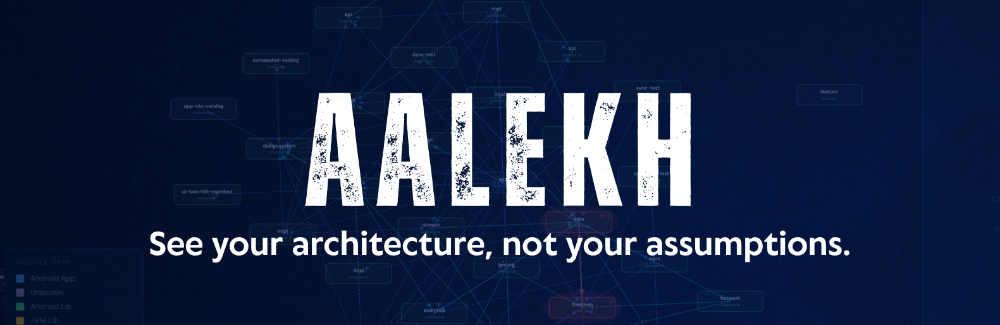
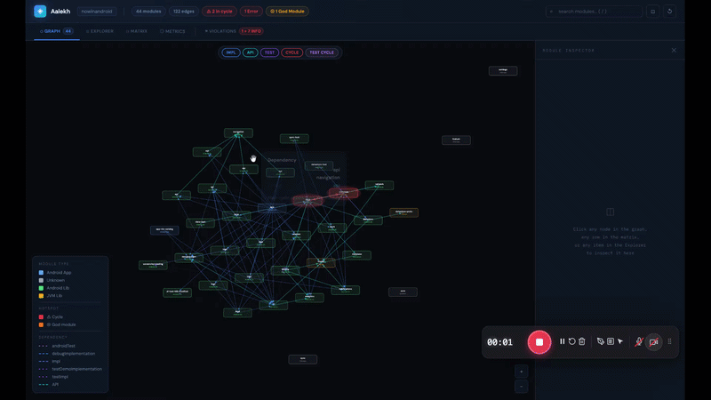

# Aalekh

<p align="center">
  
</p>

<p align="center">
  <a href="https://kotlinlang.org"></a>
  <a href="https://gradle.org"></a>
  <a href="https://central.sonatype.com/artifact/io.github.shivathapaa/aalekh-model"></a>
</p>

<p align="center">
  <a href="https://plugins.gradle.org/plugin/io.github.shivathapaa.aalekh"></a>
  <a href="https://docs.gradle.org/current/userguide/configuration_cache.html"></a>
  <a href="LICENSE"></a>
</p>

**Understand, document, and enforce the architecture of a Gradle multi-module project**

Aalekh is a Gradle plugin that reads your build - Kotlin Multiplatform, Android, JVM, or plain
Gradle - and produces an interactive report that explains the project, Markdown documentation you can
commit, and a rule engine that fails the build when the architecture drifts. It runs inside the
build, so it sees what you declared rather than guessing at it, and needs no external service.

`./gradlew aalekhReport` works with no configuration at all. Rules, layers, and ownership are opt-in
on top of it.

## Highlights

- **Interactive HTML report** - offline and self-contained: region map, force graph, layer swimlane,
  focus view, adjacency matrix, tree, module inspector, rules and violations panels, a searchable
  command palette, dark/light themes, and a KPI panel.
- **Plain-language findings** - the report explains what it found rather than only plotting it, with
  the measurements behind each statement and a suggested reading order for a project you do not know.
- **Architecture rule DSL** - layers, feature isolation, reachability, per-source-set / KMP rules,
  graph-height and orphan checks, inline `forbid { }` predicates, and custom `ArchRule`s.
- **Baseline & quality gates** - freeze existing violations and fail only on new ones, and ratchet
  structural metrics (cycles, CCD, %tangle, instability) so they can only improve.
- **Architecture diffs** - commit a snapshot, and every pull request gets a comment listing the
  dependencies, modules, and cycles it added or removed.
- **Generated documentation** - a Markdown module catalogue, onboarding guide, and metric glossary you
  can commit and review as a diff.
- **Project inventory** - plugins and their versions, version catalogs, Java toolchains, KMP targets,
  test source sets, and ownership from `CODEOWNERS`.
- **Metrics** - blast radius, influence, betweenness, Martin instability, Lakos CCD/ACD/NCCD and
  %tangle, distance from the main sequence, a rolling trend window, and a `MetricProvider` SPI.
- **Git-aware analysis** - temporal (change) coupling and hotspots, plus an affected-graph blast
  radius for a diff, each written as a local, PR-reviewable artefact.
- **Text graph exports** - diffable Mermaid and Graphviz DOT, with focus/exclude filters for large
  graphs.
- **CI-ready outputs** - HTML, Markdown, JSON, JUnit XML, SARIF, GitLab Code Quality, and CSV.

## Sample Reports

- [Now in Android](https://shivathapaa.github.io/Aalekh/assets/report_samples/nowinandroid.html) - 44 modules, layers, feature isolation, teams, nine rules
- [Now in Android, no configuration](https://shivathapaa.github.io/Aalekh/assets/report_samples/nowinandroid_noconfig.html) - what you get out of the box
- [Now in Android, with a cyclic dependency](https://shivathapaa.github.io/Aalekh/assets/report_samples/nowinandroid_withcyclic.html) - so `aalekhCheck` fails
- [Tallyo](https://shivathapaa.github.io/Aalekh/assets/report_samples/tallyo.html) - 128 modules of Kotlin/Compose Multiplatform across six product shells
- [GeoKrishiFarm](https://shivathapaa.github.io/Aalekh/assets/report_samples/geokrishifarm.html) - 51 modules of Compose Multiplatform behind private repositories

The exact `aalekh { }` configuration behind each report is documented in
[docs/real-world-examples.md](docs/real-world-examples.md).

<p align="center">
  <a href="https://shivathapaa.github.io/Aalekh/assets/report_samples/nowinandroid.html">
    
  </a>
</p>

## Quick Start

**1. Add to `settings.gradle.kts`:**

```kotlin
plugins {
    id("io.github.shivathapaa.aalekh") version "0.7.0"
}
```

**2. Run:**

```bash
./gradlew aalekhReport
```

An interactive HTML report opens automatically in your default browser. No configuration required.

## Installation

### Settings plugin (recommended)

Apply in `settings.gradle.kts`. The settings plugin loads in a classloader scope that is stable
across configuration cache entries, preventing cache misses on subsequent runs.

```kotlin
// settings.gradle.kts
plugins {
    id("io.github.shivathapaa.aalekh") version "0.7.0"
}
```

The `aalekh { }` configuration block goes in the root `build.gradle.kts` and stays exactly as-is
regardless of which plugin variant you use.

### Project plugin (deprecated)

> **⚠ Deprecated as of v0.2.0.** The project plugin will be removed in a future release. Please
> migrate to the settings plugin above.

The project plugin is applied via `build.gradle.kts` and produces a deprecation warning at build
time. To migrate: move the plugin declaration to `settings.gradle.kts` and remove it from
`build.gradle.kts`. The `aalekh { }` block stays in place.

```kotlin
// build.gradle.kts (root project only) - deprecated, migrate to settings plugin
plugins {
    id("io.github.shivathapaa.aalekh.project") version "0.7.0"
}
```

> **Why deprecated?** The project plugin is loaded in the `root-project(export)` classloader scope,
> which is not preserved across configuration cache entries. This causes a CC miss on every second
> run. The settings plugin is loaded in the `settings` scope, which is stable.

## Tasks at a glance

Aalekh registers twelve tasks on the root project, all in the `aalekh` task group.

| Task                       | Description                                                                                  |
|----------------------------|----------------------------------------------------------------------------------------------|
| `./gradlew aalekhExtract`  | Extracts the module dependency graph and writes it as JSON to `build/tmp/aalekh/graph.json`  |
| `./gradlew aalekhReport`   | Generates the interactive HTML report at `build/reports/aalekh/index.html`                   |
| `./gradlew aalekhCheck`    | Evaluates all architecture rules; fails the build on `ERROR`-severity violations             |
| `./gradlew aalekhMermaid`  | Exports the graph as diffable Mermaid text that renders on GitHub and in IDEs                |
| `./gradlew aalekhBaseline` | Freezes current violations to a committed baseline so `aalekhCheck` fails only on new ones   |
| `./gradlew aalekhTemporal` | Analyses git history for change coupling and hotspots (`aalekh-temporal.md` / `.json`)       |
| `./gradlew aalekhAffected` | Computes modules affected by a git diff and their blast radius (`aalekh-affected.md` / `.json`) |
| `./gradlew aalekhMainSequence` | Abstractness/instability/distance-from-main-sequence per module (`aalekh-main-sequence.md` / `.json`) |
| `./gradlew aalekhMetrics`  | Runs custom `MetricProvider` SPI implementations and writes their values (`aalekh-custom-metrics.md` / `.json`) |
| `./gradlew aalekhDocs`     | Writes architecture documentation as Markdown to `build/reports/aalekh/docs/` |
| `./gradlew aalekhSnapshot` | Records the current architecture as a committable `aalekh-snapshot.json` |
| `./gradlew aalekhDiff`     | Reports what a change did to the architecture, as a PR comment (`aalekh-diff.md` / `.json`) |

Every task depends on `aalekhExtract` implicitly, and `aalekhCheck` wires into the standard `check`
lifecycle automatically. See [Gradle tasks](docs/tasks.md) for details.

## Documentation

Full reference documentation lives in [`docs/`](docs/README.md):

| Guide | What's inside |
|-------|---------------|
| [Gradle tasks](docs/tasks.md) | All twelve `aalekh*` tasks — what each does and produces |
| [The report](docs/report.md) | The interactive HTML report: nine panels, findings, typed queries, presentation mode, themes, permalinks, inspector |
| [Configuration](docs/configuration.md) | The `aalekh { }` block, captured configurations, module types, declared metadata, configuration cache |
| [Architecture rules](docs/rules.md) | Built-in rules, layers, feature isolation, team ownership, reachability & per-source-set/KMP rules, quality gates, baseline, gradual adoption, SARIF, custom rules, extension points |
| [Metrics & output](docs/metrics.md) | Graph metrics, Lakos coupling & main-sequence, temporal coupling, output files, CSV export, trend history |
| [CI setup](docs/ci.md) | Wiring checks, architecture diffs, and generated documentation into a pipeline |
| [Real-world examples](docs/real-world-examples.md) | Working `aalekh { }` configurations from three real projects |

A minimal `aalekh { }` block to enforce layered architecture:

```kotlin
// build.gradle.kts (root project)
aalekh {
    layers {
        layer("domain") { modules(":core:domain", ":feature:*:domain") }
        layer("data") {
            modules(":core:data", ":feature:*:data")
            canOnlyDependOn("domain")
        }
        layer("presentation") {
            modules(":feature:*:ui", ":app")
            canOnlyDependOn("domain", "data")
        }
    }
}
```

See [Architecture rules](docs/rules.md) for feature isolation, team ownership, reachability and
per-source-set rules, `forbid { }` predicates, quality gates, baselines, and custom rules, and
[Configuration](docs/configuration.md) for the full option reference.

## Compatibility

| Aalekh        | Gradle | Kotlin | AGP  | JDK        |
|---------------|--------|--------|------|------------|
| 0.1.x - 0.7.x | 9.0+   | 2.3+   | 9.1+ | 11, 17, 21 |

Aalekh requires the **settings plugin** (`settings.gradle.kts`) on Gradle 9.x because configuration
cache is enabled by default and the project plugin cannot safely capture inter-project state across
CC entries. Kotlin DSL (`*.kts`) is required - Groovy DSL is not supported.

## Contributing

Contributions are welcome. Please read [CONTRIBUTING.md](CONTRIBUTING.md) before opening a PR.

```bash
git clone https://github.com/shivathapaa/aalekh.git
cd aalekh
./gradlew build          # compile + all checks
./gradlew checkAll       # unit tests + static analysis, every subproject
./gradlew :aalekh-gradle:functionalTest   # GradleRunner tests (slower)
```

To try a change without publishing, use the in-repo [`sample/`](sample/README.md) consumer project -
it applies the plugin via `includeBuild("..")`:

```bash
./gradlew -p sample aalekhReport   # then open sample/build/reports/aalekh/index.html
```

To dogfood against a real external project instead, run `./gradlew publishToMavenLocal`, then add
`mavenLocal()` to that project's `settings.gradle.kts` repository list.

## License

```
Copyright 2026 Shiva Thapa

Licensed under the Apache License, Version 2.0 (the "License");
you may not use this file except in compliance with the License.
You may obtain a copy of the License at

    https://www.apache.org/licenses/LICENSE-2.0
```

<p align="center">
  Made with ♥ for the Kotlin community
  <br/>
  <a href="https://github.com/shivathapaa/aalekh/issues">Report a bug</a> ·
  <a href="https://github.com/shivathapaa/aalekh/issues">Request a feature</a>
</p>
